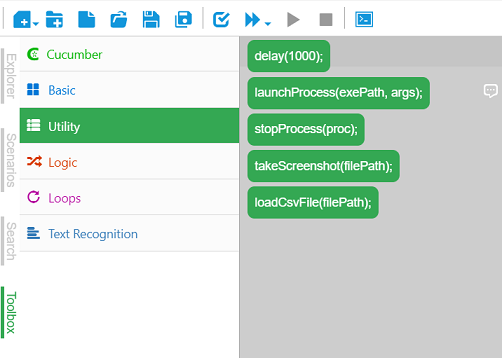
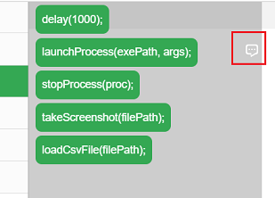
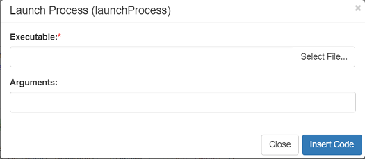

## Code Toolbox

CukeTest provides a code toolbox to help you generate code quickly and easily by dragging and dropping. When you open or create a project, the code toolbox will appear as a tab in the left column:

The code toolbox includes the following code categories:

Category | Description
---|---
Cucumber | Cucumber Hooks, CukeTest APIs
Basic | function stub, try/catch etc.
Utility | launch process, delay, takeScreenshot, load CSV files etc.
Logic | "if" and "switch" statements
Loop | for, while etc.
Text Recognition | OCR function

The Cucumber code block includes the following functions:
* [Before hook](/cucumber/support_files/hooks.md)
* [After hook](/cucumber/support_files/hooks.md)
* [BeforeAll hook](/cucumber/support_files/hooks.md#beforeall_afterall)
* [AfterAll hook](/cucumber/support_files/hooks.md#beforeall_afterall)
* [setDefaultTimeout](/cucumber/support_files/timeouts.md)
* [CukeTest APIs](api.md)

For text recognition related APIs, see [Image Character Recognition (OCR)](/node_api/ocr.md)

Some APIs with parameters provide helper dialogs to help generate code. For example, the "launchProcess" API, there will be a dialog icon on the side of the API with dialog box, as shown below:

When the API is dragged to the appropriate location in the code, a dialog is displayed, as follows:

Parameter with "*" is required, others are optional parameters.
