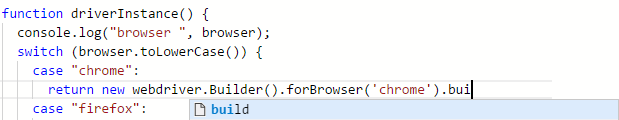

# IntelliSense and Autocomplete

CukeTest has code auto completion, which makes it very convenient to edit test scripts. You don't have to remember much details about the library you are using, and intellisense will remind you about the method signatures and properties.



Here are some explanation about this feature:
* CukeTest editor already support intellisense Node.js libraries, which means you can get all Node.js intellisense out of box.

* For libraries pre-configured in the project templates, intellisense is also available after downloading the package. For example, after you create a "Web" project and download NPM packages, you will have the intellisense available for "selenium-webdriver". If you have a statement like:
var driver = require('selenium-webdriver');
in the next line when you use variable "driver" and then ".", you will be prompted with all the exported methods and properties of this library. This was made possible by using "@types" packages derived from [DefinitelyTyped](https://github.com/DefinitelyTyped/DefinitelyTyped) project. In package.json, the following package is used for intellisense:

```json
   "dependencies": {
      "@types/selenium-webdriver": "^3.6.0"
   }
```

* If you are using some other NPM packages in your project, and want intellisense for them, you can also find the corresponding @types packages and configured similiarly in your package.json. [here](http://microsoft.github.io/TypeSearch/) is the web site to look for typing libraries.


