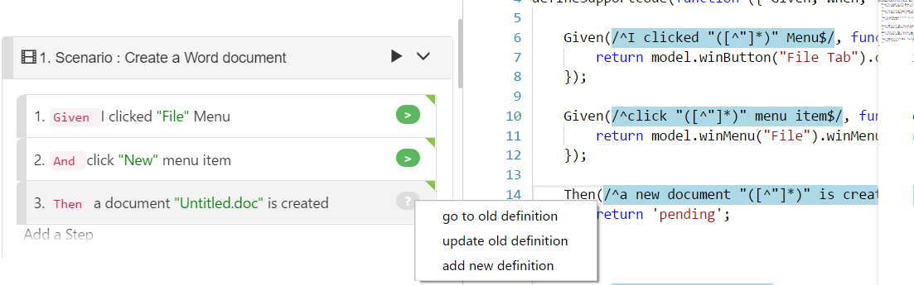

# matching

## Code / Feature Matching

CukeTest is a great tool for users who want to edit Feature documents and test scripts in a synchronized way.

The related features are:

* Having a step text, locate the corresponding JavaScript function that serve this step.
* Having a step text, generate a code snippet accordingly.
* Having a code snippet, locate the corresponding step \(or steps\) that matches this code snippet.
* A badge beside step text, to indicator of whether a step has zero, one or more scripts functions that match the step.
* [Validate project](../features/overview.md#validate), to get a report how complete is the project and the errors.

As the following screenshot shows, when a badge is clicked, it will either jump to the matching code, or generate code that match the step definition .

## Locate/generate code stub of a step

When editing a feature file in [Visual Mode](../features/visual_mode.md), for a Step created in a Scenario, you can generate the javascript stub automatically. To do it, first make sure the script you want to insert the code stub is opened on the right panel, then click the badge on the right side of the step.

If the code stub is already created in some javascript file in your project, simply click the badge, and it will locate the code stub for you.

If you have duplicate stubs that matches the same step, clicking the badge will pop up a dialog, asking which code location you want to go to. Please note that this situation typically means an error in the cucumber script. One Step should have only one matching Step Definition, otherwise this Step will fail to run. The duplicated Step Definition should be modified or removed.

### Code Generation

CukeTest can generate stub code for a Step, and insert it into the JavaScript file that is currently opened. To generate, you must be in [Visual Mode](../features/visual_mode.md).

In Project Mode, you can generate code automatically for Step. To generate code stub for a Step, simply click the round button on right side of the step. The button has several colors to indicate the state. You can find explanations below:

1.  Gray, indicate an undefined Step. Meaning that there is no step definition matches the current step. Clicking the button will generate a new stub. You may have several script files in your project, to generate stub in your target script file, please first open the file on the right panel.
2.  Green, indicate that that there is exact one step definition match this step, and it has been implemented.
3.  Orange, indicate that the step has a step definition stub, however, it is not implemented yet.
4.  Red. Indicate redundant step definitions. There are multiple step definitions match this step. It will cause error during execution. You can fix it by removing one duplicate step definition, or update the regular expression in the step definition.

If you click Red button, a dialog appears, show you all the occurrence of the matching step definitions.

## Update Code after Step Change

When step text is changed, step definition should be updated accordingly, in order to match the new text. You can do it easily in CukeTest, typically with a single mouse click.

In the following screen, I plan to update the step 3 by removing the word “new”:

When the text is updated, the text in the badge is also changed from "&gt;" to "?", meaning there are more options waiting to be chosen. When this badge is clicked, it will pop up a context menu with the following entries:

1. “**go to old definition**”，will open and highlight the previous matched step definition on the right side, even if it no longer matches the new step text. User can then manually update the expression so that it match new step text, or make some other necessary changes.
2. “**update old definition**” will update the matching expression in the step definition code for you, to ensure it matches the new step text. 
3. “**add new definition**” will create a new step definition template function to match the new step text.

The following screen shows the UI after step text is updated.

In the above screen, when you click “update old definition” it will update the regular expression on the right to match the new text. Please note that if you have changed the parameters in the step text, e.g. add some more parameters, you may need to update the code manually to use the new parameters.

