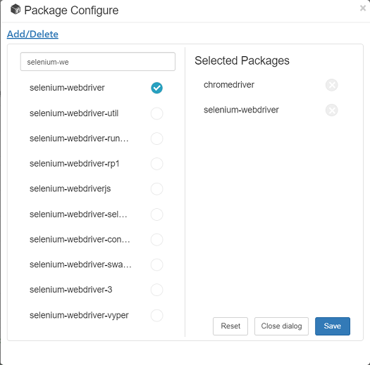

# NPM Packages Management

A Cucumber.js script is also a Node.js script. Most Node.js projects have NPM packages dependencies. For example, when you do web automation test, you may need `"selenium-webdriver"` and `"chromedriver"` npm packages to automate Chrome browser. These packages have been pre-configured in the package.json when you create a new project from "Web" project template.

CukeTest ships with Node.js capabilities, which means you can run Cucumber.js script without installing Node.js. It means you can run your node scripts in CukeTest even you do not have Node.js installed on your machine, it makes CukeTest also a tool for developing Node.js scripts.

## Package Configure
Please note that CukeTest has the following types of releases, 
1. Windows Store
2. Windows Desktop
3. Mac version
The version from Windows Store has some limit on functionality, to conform to the policy Windows Store, you cannot download packages from within the application. And you need to do it externally using NPM command.

Package Configure dialog is used for editing package list, you can use “npm install” command install your packages separately, as long as node.js has been installed on your machine.

### Edit Packages
You can edit package.json conveniently with Package Configure UI. You do it on "Add/Delete" tab of the dialog. On this UI you can search for existing packages and add it to your package.json config list.

When type the partial keyword in the search box, you will be prompted with the packages that match this keyword, sorted by the popularity of the package. then click the package entry, it will be added to the right, which is the package list configured in package.json. Please note that you need to connect to internet in order for this search function to work.

You can also click "X" mark on the right list, which will remove the package entry from package.json. Here is the UI showing the editing of packages:

After you selected all needed package names, click "Save" button to save all changes to package.json.

Please note: the npm packages added to package.json will be configured to use the the latest version. If your project need to depend on a specific version of this package, it need to be edit manually after you save the packages list from this UI.

