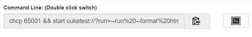

# Command Line Interface

User who use Cucumber or Node.js know how to run a cucumber test from command line. CukeTest also supports running test from command line, but with different format.

The command line provides you with a way to execute the script directly without opening the CukeTest IDE. It can be used to automatically execute scripts in Continuous Integration (CI) tools such as Jenkins.

Please note that the Desktop and App Store versions of CukeTest have different command lines. If you switch from one version to another, please update your command line accordingly.


## Windows desktop version

After CukeTest is installed, CukeTest executable will be added to the PATH environment variable, when input “cuke" in command line, CukeTest will be launched. Here use some sample to explain its usage.

1. Open the current folder as a problem:
  ```
  cuke .
  ```

2. Open the feature/feature1.feature file in CukeTest:
  ```
  cuke feature/feature1.feature
  ```
  
3. If "--run" parameter exists, it will run the current folder as a cucumber project，please refer to the following table for all options:

Option               |   Explanation
---                  |   ---
-r, --run            |  run cucumber project
--runjs              |  run a javascript file
-m, --man            |  display help document
-f, --format [value] |  report format, should be "html", "text" or "json"
--overwrite          |  whether to overwrite existing report file
-b --browser [value] |  type of browser to run
-t --tags [value]    |  [tag expression](/cucumber/tag-expressions.md) to filter scenarios
-o --out [value]     |  output dir
-v --video           |  whether to record video
--failfast           |  abort the run on first failure
-h, --help           |  output usage information

In addition to the above parameters, you can add zero or more feature file paths or folder paths in the command line, and run the specified feature files.

4. You can also use "--profile" parameter with a profile name to run a profile. The run profile name and corresponding parameters are configured in the "config/cucumber.yml" file. You can refer to [Run Profiles] (profiles.md) to understand how to configure a profile.

If you want to run the project, please execute the command in your project directory. Here are some examples of parameters:

   * `cuke --run` 
   
      Run the project with the default configuration, output report to console in text format
   * `cuke --run --format html` 
  
      Run the project and generate report in html format
      
   * `cuke --run --format html --video`
   
      Generate html reports and record videos
      
   * `cuke -r -failfast -t "@backend or @ui" 
   
      Run scenarios that have @backend or @ui tags and stop running if any scenario fails
      


## Windows Store version

As a Windows Store application, CukeTest need to follow Windows Store application guideline when running app from command line. Therefore, the parameters is different from what you see in Cucumber.js. for each project, you can follow below steps to run test from command line: 

1. clicking Run -> Run Profiles menu. In the Profile editing dialog, play with the profile configurations, copy the command line parameters from the bottom on this dialog.
2. click the "Open console window" button
3. in the console window, paste the copied text into the window.

   

## Mac version

The Mac version of CukeTest also supports command line. The format is similiar to the desktop version. The command line can also be generated from the "Profile Edit Dialog".