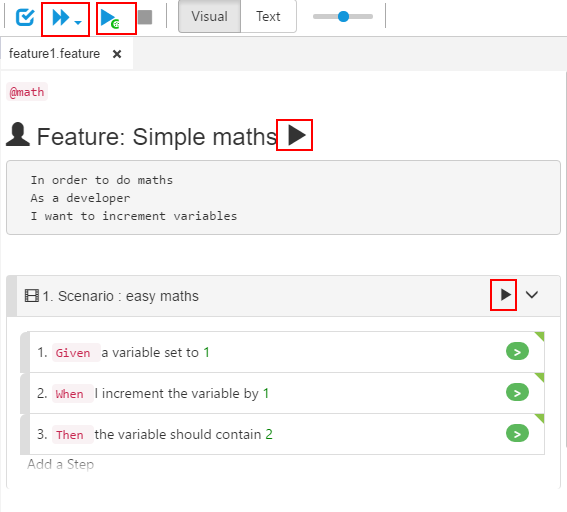
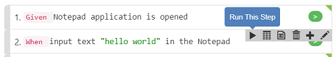
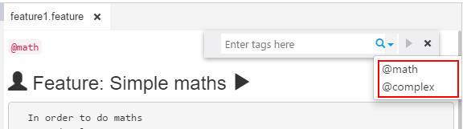
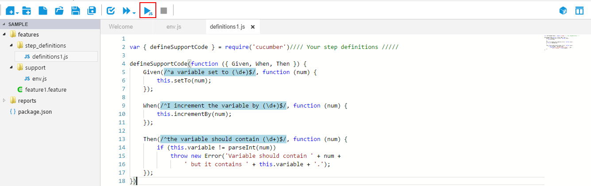
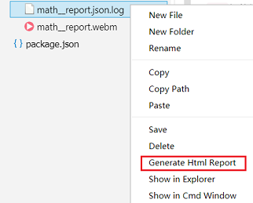

# Overview of Execution

CukeTest enables you to run your project or part of your code in various ways:

* Run project
* Run a pre-configured profile
* Run a Feature
* Run a Scenario
* Run a Step
* Run Scenarios filtered by Tags
* Run a JavaScript file

## Run project

On the toolbar, you can click `"Run Project"` button to run the entire cucumber project

## Run a pre-configured Profile

You can have multiple pre-configured profiles for your project, to customize how Cucumber project should run. Then you just click the profile to run it. In profile you can filter Scenarios with tags, set Browser type, report output directory etc.
Check out [Profiles Editing](/execution/profiles.md) for more information.

## Run Feature

In [Visual Mode](/features/visual_mode.md), you can find `"Run"` button beside the Feature title. Clicking it will just run this feature file. 

## Run Scenario

In [Visual Mode](/features/visual_mode.md), you can find `"Run"` button beside each scenario. Clicking it will just run this scenario. 

## Run a Step

One scenario can have multiple steps, and sometimes you need to run only one of these steps for debugging purpose. At this point you can right-click on the step and click "Run this Step" in the step-by-step toolbar:

>**Note**: The operations that some steps perform rely on the context set up by the previous steps. Therefore please be aware that "Run a Step" will only succeeds when the context are set up correctly.

## Run Scenarios filtered by Tags

Click "View" => "Filter with Tags" menu, you can open a search box, in which you can type tags to filter scenarios in an opened Feature file. You can then click the "Run" arrow button next to the search box, to run the filtered Scenarios.

## Run JavaScript file only
User can open a JavaScript file and run this file directly, just like do it with node using command `node your_file.js`. This is provided for you to conveniently start your project from a simple JavaScript file, or for debugging purpose. Please note that if you have both Feature document and JavaScript file opened at the same time in editor, you can only run the Feature file. To run JavaScript file, close the Feature documents and leave only JavaScript file open. 

## Stop Project Manually

If you force a running project to stop manually, you may get partial report results depending on how the project runs:

* **run from UI, html report**：If you run the project from CukeTest UI, and click the stop button before the project finishes, it will stop run, and an html report will still be generated and opened, as long as there are any scenarios finished running. If there is no scenario finishes, the html report will not be generated.
* **run from terminal, html report**：If run the project from the command line, and specify html format report, when the running is stopped by force, you can only get the intermediate file with the \*.json.log suffix. You can still generate html report manually from this log file, by right clicking this log file on file explorer in CukeTest and select "Generate Html Report". html report will then be generated and opened.

* **json report format**: If you specify to output json reports, it will only be generated after the project runs to the end. There will be no report files if stopped running by force.