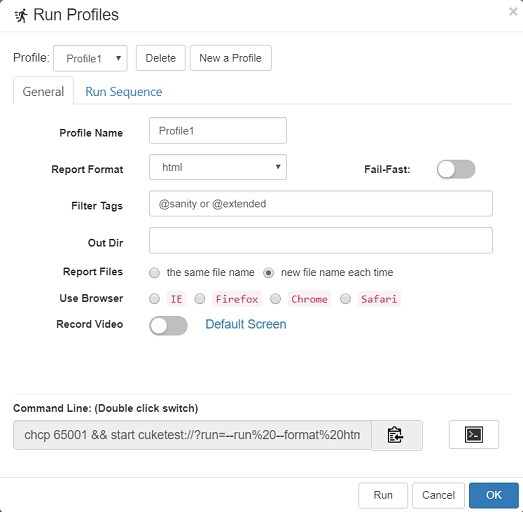
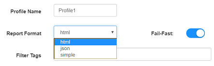
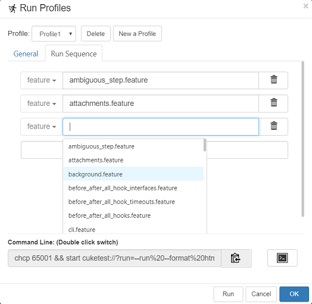
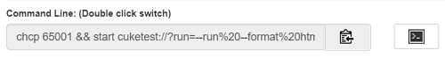

# Run Profiles

Profile is a pre-configured settings on how to run a Cucumber project. You can have multiple preconfigured run profiles for one project. In profile configure dialog, you can configure:

1. **Report Format**. There are three report formats to choose from: html, json and simple. 
2. **Fail-Fast**, abort the run on first failure
2. **Filter Tags**, used to filter the scenarios to run
3. **Out Dir** the location to store report files
4. **Report Files** controls whether the same report is generated for each run, or generate reports with new file name each time
5. **Use Browser** which browser to launch when running test script. 
6. **Record Video** which can record a video of screens during replaying
7. **Run sequence**, you can specify the feature file to run, and its order

Below is the screen of the profile editing dialog:



To configure profiles, click Run => Edit Run Profiles... menu, or click the corresponding item on the toolbar (down arrow next to "Run Project" button). 

The configured profiles are saved as "configure/cucumber.yml" file under your project.

Here are some detailed explanations:

<a id="format"></a>
## "Report Format"

There are three report formats to choose from:
* html
* json
* simple



If Report Format is "html", there is also another setting affects the report layout, which is "Report Theme", this is a global setting that affects all projects, and there are 3 report themes. For more information, check [Report Theme](/execution/reports.md#theme)

The `"simple"` format report will still be saved as a html file. The content of `"simple"` report have the same content and coloring as running Cucumber.js from command line with default parameters.

>Note: You can choose to output reports in multiple formats such as html+json, or simple+json, but you can't choose html+simple, because “simple” is also in html format.

## "Fast-Fail"

When this switch is turned on, it stops when the first exception occurs.

## "Filter Tags"

The tag filter uses a tag expression to filter scenarios when running profile. Only scenarios that match the tag expression will be run. See [Tag and Filter](/features/tags.md#run) for more details.

## "Out Dir"
If relative path is used, the report will be generated in your project folder [project_folder]/reports/[out dir]. Or if you use absolute path for "Out Dir", report will be generated directly within this folder.

## "Report Files"
The default setting is "the same file name", which also applies when run without creating any profile. The same report file name is used, which means the newly generated report will overwrite the previously generated one. The report file can be found in the "reports" sub folder in the current script folder. For example, if your project name is "shopping", the report will be "shopping_report.html" or "shopping_report.json".

If configure this setting to be `"new file name each time"`, it will generate new file name each time. with name format [project]_[date]_report.[number] For example, "shopping_2017-07-15_report1.html".

## "Use Browser"
This setting works with the script created with "Web" template. It sets the BROWSER environment variable automatically and in world.js, the script reads the browser information from this environment variable:
```javascript
    var browser = process.env.BROWSER || "CHROME";
```
    
## Record Video
User can record videos during the script execution, as long as user turn on **Record Video** switch. At the same time, user can select which screen top record. The video will be recorded as *.webm format, which can be replayed directly in Chrome or FireFox browser, or some other media players.

You can also replay the *.webm file in CukeTest, by clicking the file in the project tree, CukeTest will open a new window to replay the video file.

## "Run sequence"

You can set a running sequence in the second tab to specify a feature file or a folder:



Each line can specify a feature file or a folder. When you enter multiple lines, it runs from top to bottom. When you add a folder, the files in the folder are executed according to the file scanning order.

When a folder is specified, all the feature files within the folder will be run. When you type in a text box, or double-click on a text box, it will prompt you with a list of feature files or folders.

When you do not specify any run sequence, all feature files in the project will run by default.

## Other UI elements

There are some other UI elements on Profile Editing dialog:

* "**Run**" button on the Profile Editing dialog, which you can run a profile directly after editing it. It will save profile for you before running.
* "**Command Line**". You can copy the command line from it to clipboard, and click "Open Console Window" button next to it, and then paste the command line into it, which can run the project with these settings.



The command line has two modes, one with all parameters and the other directly specifying the profile name. You can switch between the two modes when you double-click on the command line input box.

For details on the command line, see [Command Line Interface](/execution/cli.md)
