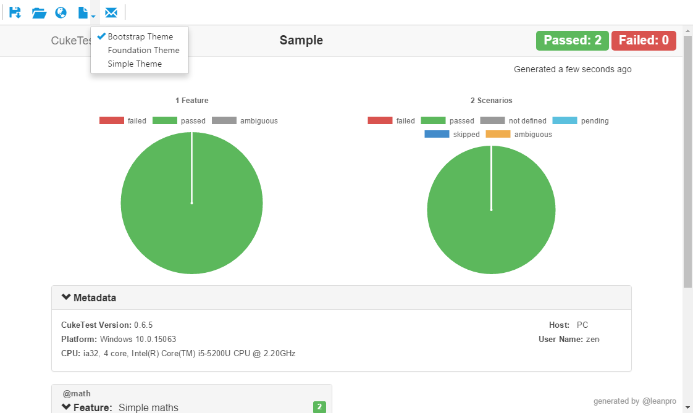
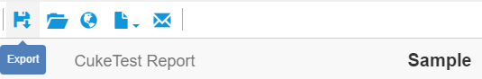

# Run Reports

## Report Format
For a project that has not configure any run profile, the report format is "html". If want to use a different format, a run profile can be configured. Refer to [Run Profiles](profiles.md) for more information. 

<a id="theme"></a>
## Report Theme
There are 3 report themes you can choose from:
* Bootstrap
* Foundation
* Simple

To configure which HTML theme, open File -> Settings menu, this is a global setting that affect all projects




## Save Screenshots into Report
Screenshots can be captured during the script run. The following statement can capture a screenshot and embedded in the report:
```javascript
    driver.takeScreenshot().then(function (screenShot) {
      scenario.attach(new Buffer(screenShot, 'base64'), 'image/png');
    });
```

Screenshots be saved either as individual image files, or be embedded into the html or json report file when you choose one of them as report format. This settings configures whether to save images in report file or separately.

## Latest Run Report
To view the report that is generated from the last run, user can click menu `Run` -> `Latest Run Reports`


## Report Window
Report window is shown when project finish running.

>Please note: if you just run a feature or a scenario, instead of run project or a running profile, no standalone report file will be generated for you, and report window won't be shown. 

On this report window, you can:
* Export report to a PDF file. (for html and simple report only)
   
* Open folder that contains the report file
* Show report in default browser window
* Show report in a different report theme, if the report is just generated
* Send report in a mail. If the report has no screenshots, or has screenshot data embedded in html file, the report file will be attached directly to the mail. If the report has some external linked screenshots, the report file and the screenshots will be zipped and attached to the mail. 

