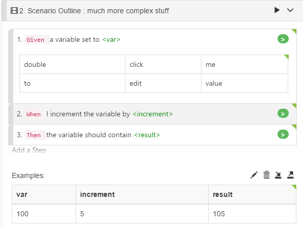

# Feature Examples

**Example** is a concept in [Scenario Outline](/cucumber/concepts.md#outline). For each row of data in an Example, the steps of Scenario Outline will be executed and the corresponding data will be filled in the parameter.

You can have zero or more Example tables in the Scenario Outline. If no Example table appears in the Scenario Outline, this Scenario Outline won’t even be executed during the execution.

Typically one Example table is sufficient for one certain Scenario Outline. However, there are cases when you want to categorize Example rows into different groups, and using tags to run only some of groups for a test run. For more information on how to use Tags to in the Gherkin Document, please refer to [Tags](/features/tags.md).

You can edit Example table in place. Double click either header cell or data cell can change the row to be editable, your change to the cell will take effect if you switch focus to the next cell.

## Keyboard Navigation
When Example table is in edit mode, you can navigate among cells using keyboard. To move to the next table cells, you can press Enter or Tab. To move to the previous table cell, you can press `Shift-Enter` or `Shift-Tab`.
