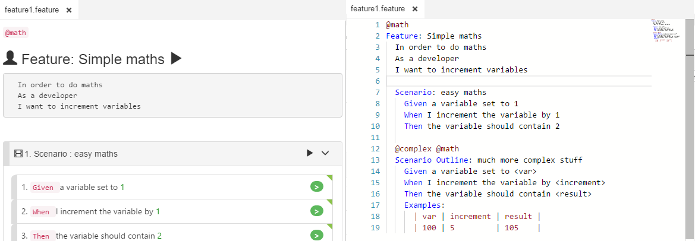
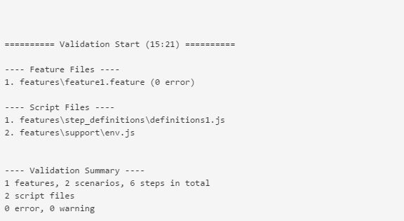

# Feature Editing Overview

CukeTest is a powerful editor for gherkin \(\*.feature\) files. It provides 2 editing modes when editing Gherkin file, [Visual Mode](visual_mode.md) and [Text Mode](text_mode.md).

You can switch between these two modes by clicking `"Visual"` or `"Text"` buttons on the toolbar:

Multiple feature documents can be opened at the same time, each document have their own editing mode.

## Validate Project 

User can verify the correctness of a Cucumber project code by running it. It will be even better if the project can be validated before run.

`"Validate Project"` button on the toolbar can help user validate various errors that may occurs in the project, or raise warnings. Here are some error or warning that can be identified by `"Validate Project"`:

* Scenario Outline without Example table
* Step has no matching code
* One step has multiple functions that matches it
* JavaScript syntax errors
* Step definition stub exists, but not implemented yet

  

## Document Editing vs. Project Editing.

You can use CukeTest to either edit individual documents or use it to open a folder that contains Cucumber.js test scripts. The former is referred to as Document Editing while the latter is called as Project Mode.

There are some differences between these 2 editing modes:

* If you edit individual Gherkin files, you are not able to run the Cucumber test that this Gherkin file represents. Execution is available only in Project mode.
* The folder navigation window is only shown in Project mode.
* Some editing functionality, e.g. generating stub for Steps, are only available in Project editing mode.

