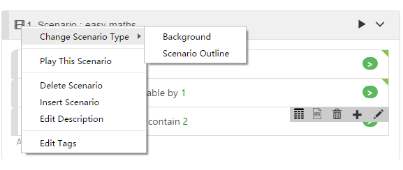

# Scenario Editing

The editing actions discussed on this page only applies to [Visual Mode](visual_mode.md).

## Add Scenario

There are 2 ways to add a scenario to the Feature file. Append Scenario or Insert Scenario:

## Append Scenario

Navigate to the bottom of a Gherkin document. You will see **"Add new scenario"** button to add a new Scenario, click it and a new Scenario appears.

## Insert Scenario

If you want to insert a scenario in the middle of a document, you can right click a Scenario title, a context menu will pop up, showing a list of actions related to the current scenario. You can then select `Insert Scenario` menu item. A new Scenario will be inserted before the current selected Scenario. Please notice that you cannot insert scenario before "Background" scenario, [Background](/cucumber/concepts.md#background) has to be listed as the first scenario in a Feature file.

## Edit Scenario

Right click Scenario title bar pop up the Scenario context menu. You can see actions that can be performed on a Scenario, for example:
* "Change Scenario Type"
* "Delete Scenario"
* "Append Scenario"
* "Edit Description"

## Change Scenario Type

Converting a scenario among different Scenario types. There are 3 type of Scenario: **[Background](/cucumber/concepts.md#backgrounds)**, **[Scenario](/cucumber/concepts.md#scenario)** and **[Scenario Outline](/cucumber/concepts.md#outline)**.

Scenario Outline can be considered as a template for scenario, which can run a scenario multiple times with different parameters. To know the concept of Scenario Outline, read [here](/cucumber/concepts.md)

To convert a scenario from one type to the other, you can:
1. Right click title bar of the Scenario to pop up the context menu,
2. Hover mouse over `Change Scenario Type` menu item, and it will shows you the target scenario type to convert to.

There are some constraints on conversion:

* Scenario Outline cannot be converted to Background directly, need to be converted to Scenario first and then to Background
* You can convert a `Scenario` to `Background`. However, as there can be only one `Background` in a Feature document, you can only do this conversion when there currently no other `Background` in the document.
* If you convert a `Scenario` to `Background`, it will be moved to the top of the document.

You can convert a Scenario to Scenario Outline, Scenario Outline is a way of running a Scenario multiple time, each time with different parameters. Therefore, if you have parameters in the Scenario before the conversion, CukeTest will create an Example table, and move the parameters from Steps to Example. The name of parameters in the Example table are auto-generated default names. You can double-click Example table to edit these names. For more information about Example editing, please refer to [Examples](/cucumber/concepts.md#example).
