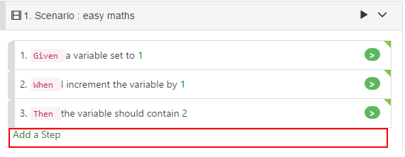
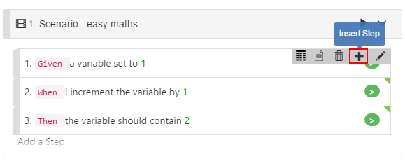
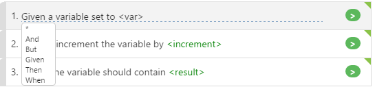
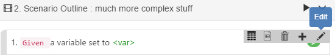
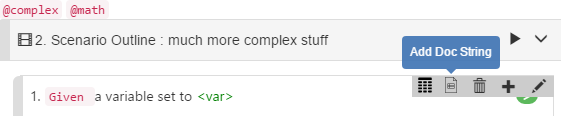
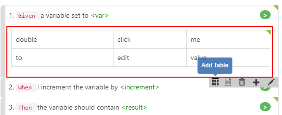

# Step Editing

## Add Step

There are 2 ways to add a Step to the Scenario. "Append Step" or "Insert Step":

## Append Step

You can find button`"Add a Step"` at the bottom of each Scenario, clicking it, a new step will be add to the end of the scenario.

## Insert Step

If you want to insert a step before the current step, you can single click the current step, a toolbar appears, on the top-right corner, select `"+"` button from the toolbar, and a new step is inserted before the current step. 

## Edit Step

You double-click a step to edit step in place, or single click on step, and then in the step toolbar click "edit" button.

1. Double-click to edit:

   

2. Right click step to show toolbar, then select Edit from toolbar

   

In a Step, you can optionally have a "doc string" or "step table" within the step, but not both.

## Doc String

Doc string is a multi-line text string within a Step, this string data will be passed as an argument to the step definition, the code that executes for the step.

## Step Table

Step Table is a table data within the step, it will be passed as a parameter to the step definition, the code executes for the step. The editing within the step will be similiar to [Examples](examples.md).

In a Step, you can optionally have a "doc string" or "step table" within the step, but not both.