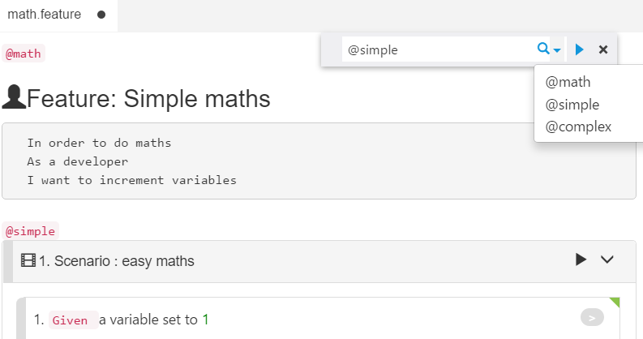

# tags

## Tags

Tags can be added to different elements of a Gherkin document, including Feature, Scenario, and Example etc. each tag must be prefixed with `"@"`. During [Visual Mode](visual_mode.md) editing, you can double-click the beginning part of the element to add tags. If you type a tag without `"@"`, editor will add it for you when you finish typing.

Tag is mainly used for filtering during editing and execution.

## Tag Filter Box

To filter document with tags, you can click menu `"View"`-&gt; `"Filter with Tags…"`, a filter box will be shown.

Tag filter box can be used to filter a Gherkin document for display or for execution. Type a tag name and press enter, it will only show the scenarios that matches the tag. Instead of typing the tag, you can alternatively click the drop down arrow to select an existing tag found in the document.

You can click "Run" arrow button next to the filter box to run the scenarios in this feature file that have only these tags.

> **Note**: If the tag is added to a Feature, it is equivalent to applying it to every scenario in this feature. When key in this tag in the filter box. All scenarios of this feature will be matched.

### Filter scenarios to running 

You can configure the scenario to run by configuring the Filter tab when you execute the project. To configure it, first create a new run profile, fill in "Filter Tags" with a filter expression. For details on how to create a configuration, see [Run Configuration](../execution/profiles.md).

For more information, please see[Tag Expressions](https://docs.cucumber.io/cucumber/api/#tag-expressions)

