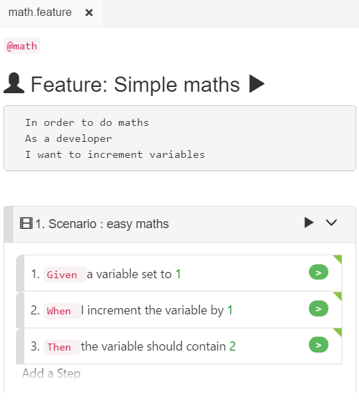

# Visual Mode

CukeTest provides 2 editing modes when editing Gherkin file, Visual Mode is explained in this page, and the other is [Text Mode](text_mode.md),

Visual Mode allow users to create and edit a gherkin file with ease. it can generates all gherkin elements with some simple clicks, including Scenarios, Steps, Examples, Tags, Descriptions, Tables etc.

There are some guidelines when using Visual Mode:  
1. Double-click any text to edit the content. For example, to change feature title, you can double click the Feature title, and it will then be in edit mode.  
2. Esc key to exit edit, the content you edit is in place  
3. Keyboard navigation is available. When you double-click a field to edit it, you can use Tab or Shift-Tab key to move to the next or the previous field for edit. The exception is the Description and Doc String fields, which supports multi-line, and Tab key as a representation in the multi-line editing.

You can do search on Visual Mode, but if you want to replace text globally, please switch to text mode.

## Keyboard Navigation

In visual mode, it is very easy to navigate between each feature elements using keyboard:

* When you are editing a field, for example a Step text, you can use `"Tab"` to navigate to the next field, and you can use `"Shift-Tab"` to navigate to the previous field.
* When you are editing a Table or an Example, `"Tab"` and `"Shift-Tab"` still works, just navigate within the boundary of the table. 
* For an Example, which has header, when use keyboard to navigate, the navigation only within the table header fields. for data rows in Example, you can use `"Tab"` to navigate to the next line, or create a new line if you are already in the last line. The new line won't be saved until you fill some data for the new line.
* When the focus navigate to "Add a Step" or "Add a Scenario", press Enter will create a new step or Scenario respectively.

