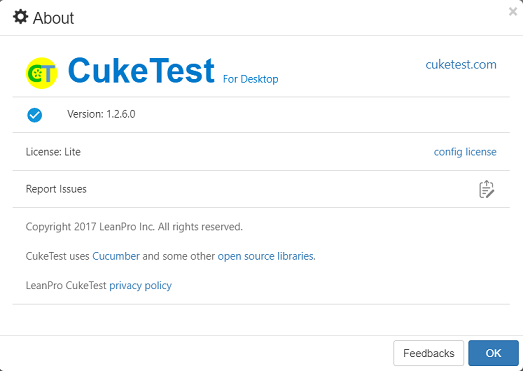
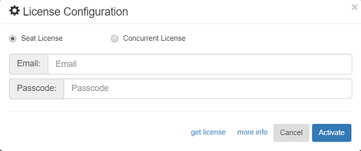
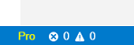
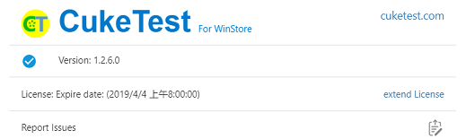
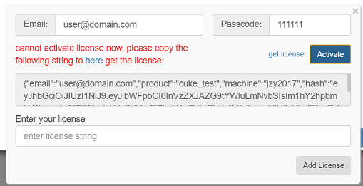

# Seat License Installation

The license can be divided into seat licenses and concurrent licenses. This page describes the installation of seat license for desktop version. The concurrent license installation manual can be obtained with the concurrent license purchased.

The seat license of desktop version is also called “user license”, which is a license granted to a user. A user will provide his email address when purchase a license. For this email address, an activation code will be received. This activation code can be used to activate the CukeTest seat license on the user's computer.

## Online activation

The steps to activate online are as follows:

1. Open the "About" dialog box in CukeTest, click `config license`,

   

   and the below License dialog appears, select "Seat License" \(which is already selected by default\), and then enter the email address and activation code:

   

2. Enter the activation code and the email to which it is bound, and click "Activate". This email address must be the one used when applying for a certificate.
3. Once activated, the dialog displays the licensed user and the activated machine name. As shown below.

   

> **Note**：The user license can only activate a limited number of computers belonging to the user for a period of time. For the same computer, the machine name can be activated multiple times without changing the name of the machine. For specific questions, please contact the company for sales or support.

After activation, the user's status will be displayed on the status bar:

## Offline Activation

If the user's computer cannot be directly connected to the Internet, the user can activate it by the following steps:

1. Still enter the appropriate content in the "Email" and "Passcode" text boxes, click "Activate". Because CukeTest is unable to connect to the Internet, the following window will appear: 
2. Copy the the license request string and open the URL on another machine that can connect to the Internet: [http://www.leanpro.cn/license/activate](http://www.leanpro.cn/license/activate), Paste the content into a the webpage and click Submit. The web page displays the license file string.
3. Copy the obtained license string to the above text box and click "Add License" to activate.

If you have any questions during the activation process, please contact your sales or support staff or click [Contact Us](http://www.leanpro.cn/contactus) to submit your question.

