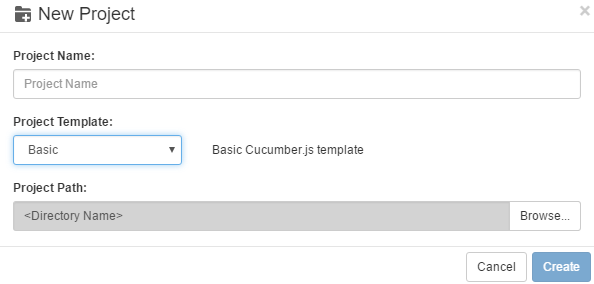

# New Project

There are currently 5 project templates to choose from when create a new project:

* **Basic**: basic Cucumber.js project
* **Web**: using `selenium-webdriver` for Web UI
* **API**: for RESTful API testing
* **Windows**: for Windows application testing
* **Mobile**: for iOS or Android testing

All these 3 templates contains package.json file, which you can add npm packages according to your need.

* **Basic** template does not have any pre-configured packages. 

* **Web** template configured "selenium-webdriver", and drivers for different browsers: "chromedriver", "iedriver", "geckodriver". With these packages, the script can automate Chrome, IE and FireFox respectively.

* **API** template configured "[got](https://www.npmjs.com/package/got)" package, which is a popular package to run RESTful API testing

* The **Windows** template uses the builtin Windows automation library and Model Manager. For more information, you can refer to [Windows Application Automation](/misc/win_auto.md)

* The **Mobile** template uses [webdriverio](https://www.npmjs.com/package/webdriverio) package，it can communicate with [Appium](http://appium.io/) to automate iOS and Android native application。

After "Web" or "API" project is created, you need to download NPM packages yourself using node.js before you can run this project. For more information, please refer to [NPM Packages](/codes/packages.md)