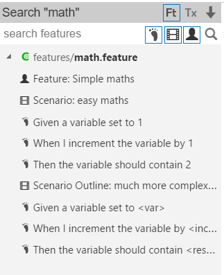
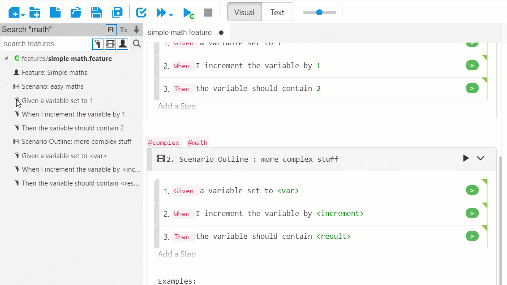
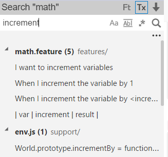
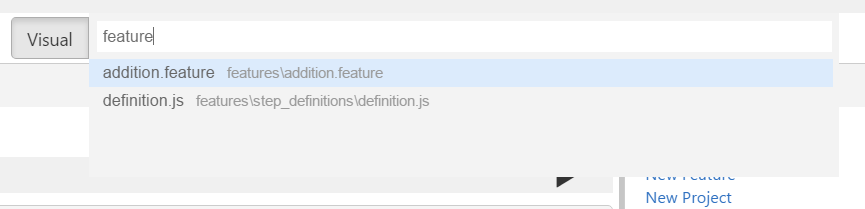

# Search

There are 2 type of search, **text search** and **feature search**. You can click the “search features”, “search files” toggle buttons to switch. If you want to jump to some file directly, you can use **quick open** feature.

## Feature Search
Feature search is used to filter feature files, or to locate the scenarios / steps that match the text. It has two modes:

* **Feature Browsing**: When type nothing in the search box, it serves as a feature browser, and will show all the features / scenarios / steps in the project you opened.
* **Feature Searching**: If you type some text in the search box, then it filters them with the text you provided. 

There are three check boxes, which will determine whether to filter “step text”, “scenario name” and “feature title” respectively. By default all three are turned on, which means if searched text appear in any of these places, it will appear in the result.

When one entry of search result is clicked, it will open the corresponding file in IDE, and also scroll to the line that the text appear.

As the following figure shows, when no text is entered, you can browse all the features, scenarios and steps in the project:

In the above screen, click any of the Feature, Scenario or Step entry will navigate you to the corresponding feature, scenario, or step.

You can also drag a step from the search result to the feature file, like the following graph:

##Text Search
Text search is intuitive. You type text and it will try to locate the matching text in the files. You can choose to include certain file types or exclude certain file types by open the file filter.

When switch to **Text Search**, you can search for text within project:

##Quick Open
If you type Ctrl-P, a window will open to help you search file and locate file quickly. You just type the text in the search, and it will show a list box of files with names match the search text. Please “Up” or “Down” arrow key to navigate between different entries and then press Enter key to open the file. You can also click the file entry to jump to the file.

