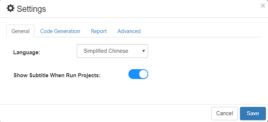
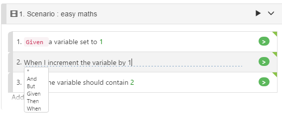
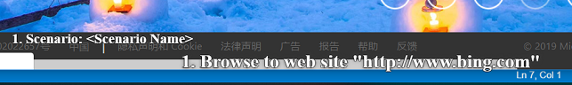
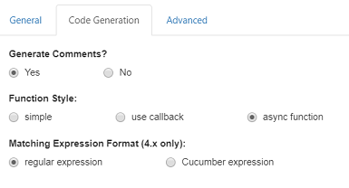
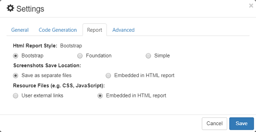

# Settings

Settings dialog is used to configure the global settings that applies to all CukeTest project on a machine.

The settings are divided into two categories: "General" and "Code Generation".

## "General" Settings

### 1. Languages 

Language will affect 2 things: 1. Displaying UI, for example, when you set to English, all the UI will be changed to English, and when you set to Chinese, all UI will be updated to Chinese. For other languages, they haven't been fully translated, so UI will display as English if the translation is not complete yet. 2. a set of keywords used in [gherkin](../cucumber/concepts.md#gherkin) document. For example in English, Step keywords can be "Given", "When", "Then", "And", "But", "_" etc. in a French gherkin document, the keywards are "Etant donné que ", "Quand ", "Alors ", "Et que ", "Mais que ". In all languages "_" can be used as step keyword to start a step.

### 2. Show subtitles at runtime 

The default is ON. The subtitles are displayed at the bottom of the screen at runtime, indicating the currently running scenario and step. For example, here are the subtitles displayed at runtime:

Subtitles informs users the current running state, and if configured to also record a screen video while executing, the subtitles can be recorded also in the video, to help track and locate scenarios and steps in the video.

## "Code Generation" Settings 

### 1. Generate Comments

Whether to generate comments when CukeTest generate code snippet from step text. By default it is turned on, you can turn it off if you don't want the default comments.

### 2. Function Style

CukeTest will generate one function call for each Step in Feature file. The function can have 3 styles:

* **Simple style**: one without any callback 
* **Callback style**: one with callback, meaning you need to explicitly call the callback to tell Cucumber that the function finished execution
* **Async style**: using async/await syntax of JavaScript. Refer to the corresponding document to see how async/await keywords can be used

### 3. Matching Expression Format

Cucumber typically use Regular expression to match a step definition function to a step. In Cucumber 4.x or above, another format "Cucumber Expression" is supported, which has better readability. You can choose the expression format you feel comfortable.

## Report 

The following figure is the configuration interface for generating html reports: 

### 1. HTML Report Style

There are 3 report themes you can configure from:

* Bootstrap
* Foundation
* Simple

  The default setting is **Bootstrap**, this theme has the richest report UI. For more information, refers to [Run Reports](../execution/reports.md#theme)

### 2. Screenshot Save Location 

Whether screenshots captured in script saved within the same report file, or saved separately, and referenced by report file\(only applicable to html report format\).

### 3. Resource Files 

When your network always has access to the Internet, you can choose to use external links for resource files. At this time, files such as CSS, JavaScript will use links from external CDNs, which can effectively reduce the size of the html report.

When your network cannot access the Internet directly, you can choose to embed the resource file in the html file. The generated html report will contain all the resource files, so that you can successfully open the report in browser even if there is no network.

