# Walkthrough: Simple Test Project

This walkthrough will create a basic behavior-driven test scripts using CukeTest:

* Create a gherkin\(or feature\) file and implement the code
* Run the script and get html report
* Convert the test data driven
* Use tags to filter the run

Below are the steps.

## 2.    New Project

1. Click the \[New Project\] button on the toolbar to bring up the "New Project" dialog box. 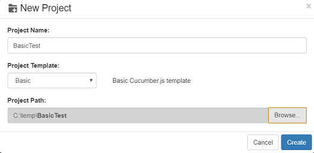
2. In the "Project Name", enter "BasicTest". For "Project Template" select "Basic". "Project Path" select a folder to place your script, click "OK". CukeTest will create a new project for you.

## 3.    Edit Gherkin File

### 3.1 Modify feature title and feature description

When the project is created with the above step, feature1.feature file will be opened automatically.

Click `Visual` button 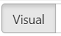, then the feature file can be modified in the "Visual" view, which looks like the follows:

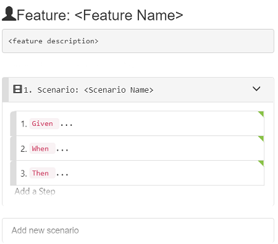

To add the name and description of the feature:

1. Double click Feature Name to make it editable, enter "Addition".
2. Press "Enter" key，you will move to the next field, which is "Feature description" field, fill the field with something like below:

```text
Verify calculator functionalities
```

Now our feature file looks like this:

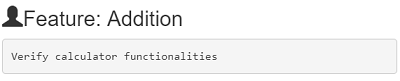

### 3.2 Add scenario

Follow the below steps to create a scenario:

1. Double click the scenario title, "Scenario Name" field is now editable, change it to "Addition of two numbers";
2. Press "Enter" key, and the focus moves to the next field, which is the first Step, select "Given" from the drop down and modify its text to "I have number 6 in calculator";
3. Follow the above steps，to add all the rest steps. To add a new steps, you can also press "Enter" to move the focus to button "Add a Step", and press "Enter" again, or just click this button: 

After the operation is done, the scenario should look like this：

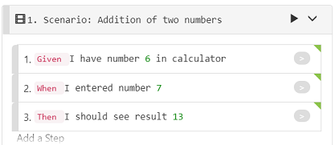

The above steps are performed on "Visual" view of feature editor, you can click "Text" button 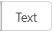 to switch to "Text" view, and the content of feature1.feature should be:

```text
Feature: Addition
  Verify calculator functionalities

  Scenario: Addition of two numbers
    Given I have number 6 in calculator
    When I entered number 7
    Then I should see result 13
```

You can also edit the feature file in "Text" view, and then switch to "Visual" view, it will have the same effect.

## 4.    Implement the automation

As we have feature file, which defines the scenario and steps, now we can implement the feature.

### 4.1 Generate the code stubs

Follow the below steps to implement the scenario.

1. Open step\_definitions/definitions1.js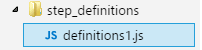 on the right panel, and make sure the feature file is opened on the left panel with "Visual" view. Click the gray button on the right side of each Step:

   

   the step definition code stubs will be generated in step\_definitions/definitions1.js:

   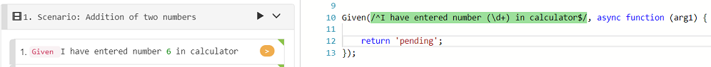

2. Repeat step 1 for the rest of Steps defined in the scenario, to generate stubs for them.
3. Create a new file “env.js” under "features/support" directory, and fill the following content:

   ```javascript
    const { setWorldConstructor } = require('cucumber')

    class CustomWorld {
      constructor() {
        this.variable = 0
      }

      setTo(number) {
        this.variable = number
      }

      incrementBy(number) {
        this.variable += number
      }
    }

    setWorldConstructor(CustomWorld)
   ```

   In this file, a custom [World](https://github.com/cucumber/cucumber-js/blob/master/docs/support_files/world.md) object is defined and it is used to manage "variable" member, which is to store the current calculation.

   "env.js" can be placed anywhere as long as it is under "features" directory. "support" directory is just a recommendation from cucumber team.

   1. Update step\_definitions/definitions1.js file, to add implementation to each step definition stubs that just added. The code will be the following:

      ```javascript
      const { Given, When, Then } = require('cucumber');
      const assert = require('assert')

      //// Your step definitions /////
      Given(/^I have number (\d+) in calculator$/, async function (num) {
        this.setTo(num);
      });

      When(/^I entered number (\d+)$/, async function (num) {
        this.incrementBy(num);
      });

      Then(/^I should see result (\d+)$/, async function (result) {
        assert.equal(this.variable, parseInt(result));
      });
      ```

### 4.2 Validate and run the project

CukeTest can validate your project, including the syntax of both the features and the script file. You can validate the script before running it, to avoid the problems during run time.

1. Click "Validate Project button, In the Output panel, you can see the validation results, it should look like the following:

   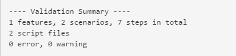

2. On toolbox, click "Run Project" button, it will run the script and generate test report.

   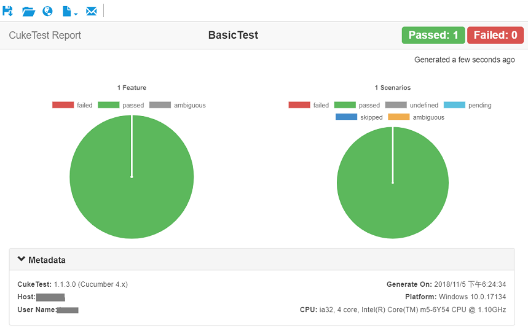 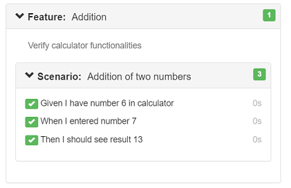

   We can see that the report has both summary part as well as the drill down detail part that shows each scenario and step running details.

### 5. Make the scenario data driven

Now we have a scenario that can work. It can run one addition operation and verify it. We usually need to test the functionality with more data input. We can do it by converting this scenario to [Scenario Outline](https://github.com/cuketest/bdd-test-automation-with-cuketest/tree/ebf5a57e99e0b73dfad103a93f3cfd53548a2f0e/cucumber/concepts/README.md#outline).

Here you can choose either to do it in "Visual" view or "Text" view. We are choosing "Visual" view since it is more convenient.

1. Click the icon on the scenario title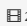, or just right click the scenario title, you will get the pop up menu for the scenario, select "Change Scenario Type" - "Scenario Outline" 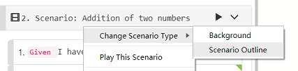

   the scenario is changed to the following, which has an example table now: 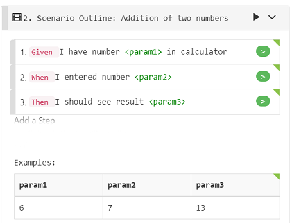

   you can notice that the scenario type on the title is "Scenario Outline" and the number parameters are automatically extracted out to a table.

2. The parameter name "param1", "param2" are not so descriptive, we will update the parameter names to something more descriptive. Now double-click the table header, and it will be editable, change the parameter names to be some meaningful names.

   Also, please update the parameter names in the steps, to be the same names that matches the Example table headers.

   You can use "tab" or "shift-tab" key to move forward and backward between the editing cells, and also you can do the same on table body to update data cells.

3. Update the data table with more rows. You can double-click anywhere in the table body to start edit. Then press "tab" or "shift-tab" to navigate. If you are on the last cell and press tab again, a new row is created, and you can edit the new row data.

   Alternatively, you can right click the table, to export the table to a CSV file, edit it somewhere else, like Excel, and then import back. Also be aware that one scenario outline can have multiple Example tables, so you can import multiple tables into a scenario outline.

   After editing, your Scenario Outline looks like the following:

   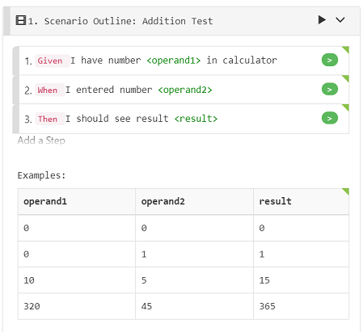

Or in "Text" view, the text should be similiar to the following:

```text
  Scenario Outline: Addition Test
    Given I have number <operand1> in calculator
    When I entered number <operand2>
    Then I should see result <result>
    Examples: 
      | operand1 | operand2 | result |
      | 0        | 0        | 0      |
      | 0        | 1        | 1      |
      | 10       | 5        | 15     |
      | 320      | 45       | 365    |
```

When run this report again, you get the report as the following:

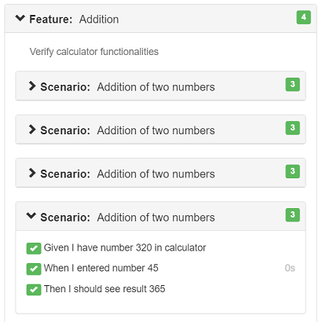

You can see that for each row of data, it will run the scenario once, so you get 4 scenario results in the report.

### 6. Customize profile run

When there are many scenarios in the script, sometimes you want to run some of them only. You can add tags to scenarios, and then use the tags to filter the scenarios to run. The following step shows how to run them.

1. Double click the area above the "Scenario Outline" to edit the tags for this scenario:

   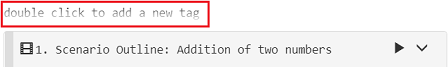

   Add a new tag named "math", and click elsewhere, the tag will be added. Each tag started with "@", if you don't add this symbol, editor will add it for you. 

2. Switch to "Text" view, edit the scenario outline to add the following text \(lines in the red circles\).

   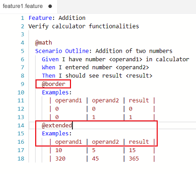

   Notice that we split the Example table into two tables, each one with a tag. Remember we can add tags to feature, scenario or example tables to filter them.

3. Click the down arrow next to "Run Project" button, and then select "Edit Profiles...":

   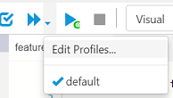

   It will open "Run Profiles" dialog, you can also open the dialog with menu "Run" -&gt; "Edit Run Profiles.

4. On this dialog, click "New a Profile" to create a new profile. In this profile, input "@math and @extended" in "Filter Tags" field.

   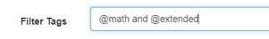

   Click "OK" to dismiss the dialog.

5. Now click down arrow again, and click "Profile1", which is just created, it will run the project with the tag filter you entered.

   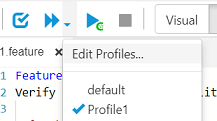

   From the test report，you can see that only scenarios data that match both "@math" and "@extended" tags run, which means that the filtering is taking effect.

   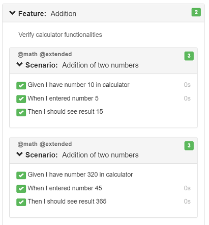

