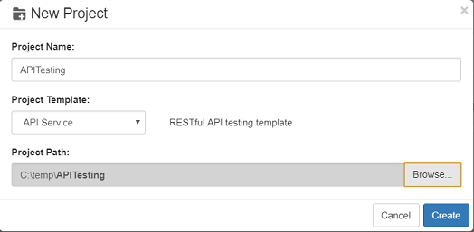
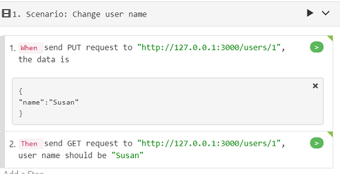
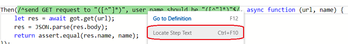
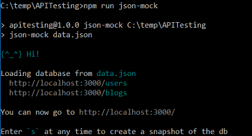
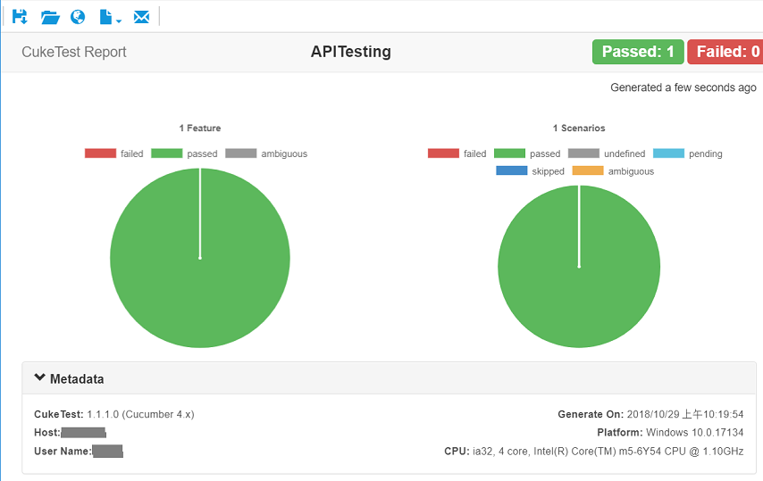
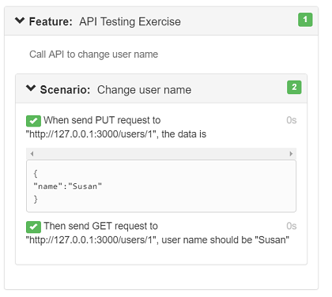
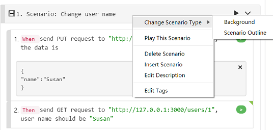
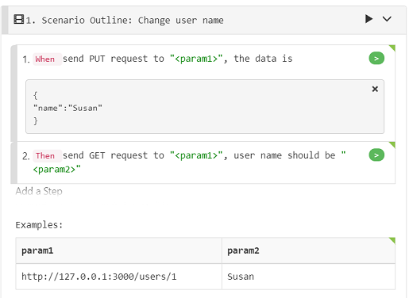
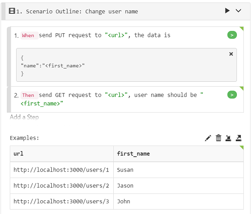
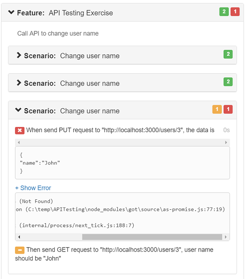

# 2\_api

## Walkthrough: Create and Run API Automation Script

During the walkthrough, you will create a BDD automation script with Node.js and Cucumber.js, and the script is used to test RESTful API services.

In this walkthrough, we will:

* Create BDD scenario and implement the scenario
* Mock an API server
* Run the automated script and view test report
* Make the test data driven

The API we plans to mock and test is a user management API, with this API, you can get the user name with "GET" method as well as update the name with "PUT" method.

Here are the steps:

### 1. Create project

1. Click "New Project" button, "New Project" dialog is opened.
2. Enter “APITesting” as the Project Name，select "API Service" as the template，and select a project path.
3. Click "Create" button to create the project.



### 2.    Download dependencies

Node.js scripts usually require some NPM dependencies. The dependencies used in this API test project are:

* **json-mock**:  API mock server
* **got**: the library that calls the APIs
* **@types/got**: the typing information of got library, which provides the autocomplete in editor

These packages have been pre-configured in the package.json by the project template. Please download the package with the instructions in [NPM Package Downloads](../codes/npm_download.md).

> **Note**: you should have Node.js installed to use npm command. Go to node.js（[https://nodejs.org）web](https://nodejs.org）web) site to learn more details.

### 3. Implement the script

It has two parts: feature and code:

1. feature file create a new feature file under "features" folder, the file name can be "api\_testing.feature" or the one you like, edit the content as the following:

   

   the text of the feature is the following:

   ```text
   Feature: API Testing Exercise
   Call API to change user name

   Scenario: Change user name
    When send PUT request to "http://127.0.0.1:3000/users/1", the data is
      """
      {
      "name":"Susan"
      }
      """
    Then send GET request to "http://127.0.0.1:3000/users/1", user name should be "Susan"
   ```

2. You can delete the default feature file "feature1.feature" and the corresponding step definitions in "definition1.js" file.
3. On the feature "api\_testing.feature", click each gray button on the right side of each step, to generate the code stubs for them. The code is generated in "definition1.js" file. Notice that the gray button turns orange when there step definition stubs are generated.
4. Further implement the code as the following:

   ```javascript
   const { Given, When, Then } = require('cucumber');
   const got = require('got');
   const assert = require('assert');

   //// Your Step Definitions /////
   When(/^send PUT request to "([^"]*)", the data is$/, async function (url, docString) {
      var data = {
          headers: { 'Content-Type': 'application/json' },
          json: true,
          body: JSON.parse(docString)
      };
      await got.put(url, data);
   });

   Then(/^send GET request to "([^"]*)", user name should be "([^"]*)"$/, async function (url, name) {
      let res = await got.get(url);
      let json = JSON.parse(res.body);
      return assert.equal(json.name, name);
   });
   ```

   The is self-explaining, in the "send PUT..." step, it constructs the JSON request, and send the request to the URL using `PUT` method, in the "send GET..." step, retrieve the JSON data using `GET` method, then verify its name is the same name we set in the previous step.

   Notice that the buttons next to the step text turns green once you implemented the code.

   If you implement the code by copying part of code from the article to your editor, make sure the variable names matches the default generated stub, for example, the default parameters generated are "arg1", "arg2" etc., please update them to match the content.

### 4.    Locate steps and step definitions

You can navigate between steps and step definitions with the following actions:

1. Click the green button  behind the step text to open the step definition code that matches the step.
2. If you are on a step definition function, and want to locate which step text on feature file that matches it, you can right click the step definition function, and select "Locate Step Text", then the corresponding step text in feature file will be shown and highlighted.



### 5.    Run Project

To run this project, we need the API service that can be tested, With `json-mock` package, we can mock an API server, below are the steps:

1. We will start the Mock Server first. Right click the the white space of project explorer area, and select "Show in Cmd Window", or just click "Open Command Prompt" button from the toolbar, both can launch CMD window. Enter command `npm run json-mock`, it should start the mock service. The command window is like the following:

   

2. Validate the mock server is working by navigating to "[http://localhost:3000/](http://localhost:3000/)" in your browser, which should show a web page with message "Congrats! You're successfully running JSON Server."
3. With mock server started, now you can run the project. On CukeTest, click "Run Project" button to run the project, it will start running, and generate test report after running.

    

You can see that the report contains both the summary part and the detail part.

### 6.    Actions on test report

When the test report is generated and shown, you can perform some further actions on the report with the toolbar above the report. For example, you can export the report to PDF file, or send the report as an attachment of an email. Below are the actions that can be performed:

1. Click "Save" button to save the report as PDF file.
2. Click "Open File Folder"  button to open the folder in explorer where report is located.
3. Click "Show in Browser" button to open the report in the default browser.
4. Click "Html Report Theme" button to select different theme to render the report.
5. Click "Email" button, it will open a new email editing window in Outlook and attach report as an attachment. \(Windows only\)

### 7. Make the test data driven

Many API tests need to pass different test parameters to API, to verify that it works with all these parameters. So we can make this test data driven, In order to make it data driven, we can convert it to [Scenario Outline](../cucumber/concepts.md#outline) first. Here are the steps:

1. Right click the scenario title, select "Change Scenario Type" =&gt; "Scenario Outline":

    It will convert your scenario to scenario outline, with parameters extracted to a example table:

   

2. We now update the Scenario Outline and the example table to have the right parameter name and data:

   a. Change "param1" to "url" in both step text and in table header.

   b. Change "param2" to "first\_name" in both step text and table header. You should also replace "Susan" in DocString to be "\". The automatic conversion does not replace the DocString content for you, so you need to do it yourself.

   c. Add more data rows to the example table. You can double-click the table body, press tabs until you navigate to a new line, and then fill some new data, make it similiar to the first line of data, only change the id and the name part. After editing, your entire scenario is like the following:

   

3. After running the test project again, you will see that the report now contains 3 scenarios. For each row in the Example, it will run the scenario outline once with the row data filled in. This capability is provided by the Cucumber. You can see that in the report, the first two scenario succeeds, while the third fails.

   

4. Open the "data.json" file in the project folder, you can also see that the first 2 json records have their name updated to "Susan" and "Jason". So we have found out the problem, it is because the mock server only has 2 records, and when we tries to update the 3rd record, the mock server returns an error "Not Found". In order to make the test pass, you need to add some more records. So copy the following data into the "users" array in the data.json file and save it:

   ```javascript
    {
      "id": 3
    },
    {
      "id": 4
    }
   ```

   > **Note**: you need to restart to mock server to make the change take effect.

5. Then run the test again, you should see that in the report, all three scenarios passed. Also opens the "data.json" file, and notice that the 3rd json object has also been updated by the automation script to have name "John".

## Summary

In this walk through, we mocked an RESTful API service that manage users, and then test this service using BDD test script, make change to a user name, and then verify that the name is actually modified.

