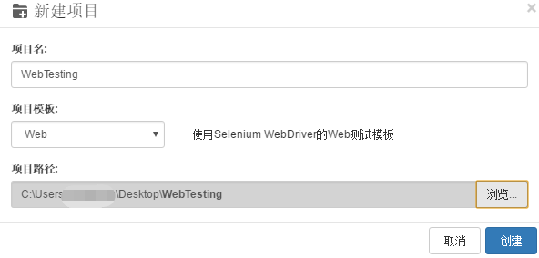
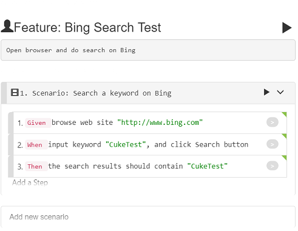
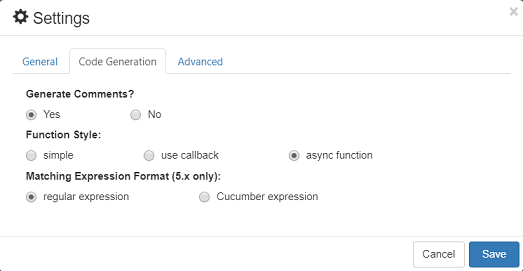
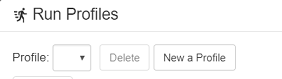
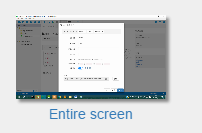
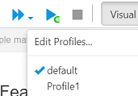
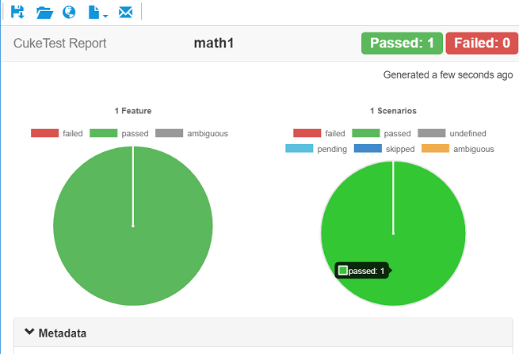
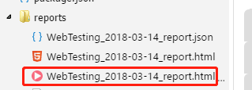

## Walkthrough: Create Web UI Automation

### 1. Goal
The objectives of this chapter:
- Define a script containing Bing search scenario
- Implement the scenario and capture screenshots in script
- Run the automation script to get test report

### 2. Prerequisites
recent updated Chrome browser

### 3. Create new project

1. Click "New Project" button on toolbar
2. Enter “WebTesting” as the project name, choose "Web" as the template, select a folder as the Project path
3. Click "Create" button to create the new project.



### 4. Configure dependencies

As a Node.js script, the project has dependency packages, the packages that are preconfigured are:

- @types/selenium-webdriver
- selenium-webdriver
- chromedriver

These packages have been pre-configured in package.json. Please download the installation dependencies in one of two ways:

- Use the command line `npm install`

   1. In CukeTest, right-click in the blank area of the file browser and select [Show in Cmd Window]. The command line window will open and the current directory is the project root directory.  
   
   2. Run `npm install` command. You should run this command under the project root directory.
   
- Use Package Manager of CukeTest:

   1. Click "Update Project Configure" button on toolbar, and on "Package Configure" dialog, click "Download" button to download the package.
   
   2. You can close the dialog and CukeTest will download it in background.
If you are using Windows Store version or Mac version, you can only use command line to download.

> **Note**: Majority of packages can be installed by CukeTest itself, some NPM packages need node.js to install successfully, e.g. chromedriver. Therefore, you still need to install node.js on your machine in order to download and install them successfully.

### 5. Write automation script

1. Update feature file to the following:

    ```gherkin
    
    Feature: Bing Search Test
    Open browser and do search on Bing
        
    Scenario: Search a keyword on Bing
    Given browse web site "http://www.bing.com"
    When input keyword "CukeTest", and click Search button
    Then the search results should contain "CukeTest"
    ```
    The UI of the scenario should be
    
    
    
2. Click "File" -> "Settings" to open settings, on "Code Generation" tab, "Function Style" option, make sure "async function" is selected.

   
   
   There are three types of functions supported by Cucumber: 1. Simple 2. Use callbacks 3. Asynchronous functions. To automatically generate asynchronous function methods, you need set the function style as "async".
    
3. Open definitions/step_definitions.js file, click gray button on each step, CukeTest will automatically generate automated step definition stubs based on the steps.

The generated stubs is a function that has not been implemented. The corresponding test case state is orange. 

4. Now we can implement the code in step_definitions.js:

```javascript
const { Given, When, Then } = require('cucumber');
const assert = require('assert');
const { driver } = require('../support/web_driver');

Given(/^browse web site "([^"]*)"$/, async function (arg1) {
    await driver.get(url);
});

When(/^input keyword "([^"]*)", and click Search button$/, async function (arg1) {
    await driver.findElement({ id: 'sb_form_q' }).sendKeys(arg1);
    return driver.findElement({ id: 'sb_form_go' }).click();
});

Then(/^the search results should contain "([^"]*)"$/, async function (arg1) {
    let result = await driver.findElement({ id: 'b_results' }).getText();
    return assert.ok(result.includes(arg1));
});
```

### 6. Run Project

#### 6.1 Configure Run Profile

Configure to record video during script running:

1. Click Menu "Run" -> "Edit Run Profiles"
2. Click button "New a Profile" to create a new run profile:
   
   
3. Turn on "Record Video" option
   
   
4. Accept default screen setting if you have only one monitor. If you have more than more monitors, select the monitor you want to record.
   
   
5. Click "OK" to save the profile.

#### 6.2 Run the project with the profile
1. Click the arrow next to "Run Project", select "Profile1", which is the one you just created.

   It will run the project with this profile setting. Also it will set this profile as the current profile to run, clicking "Run Project" next time will run this profile. The selection will take effect until you restart the CukeTest.
   
   
2. When running the project, it will open Chrome browser, navigate to Bing Search, excute actions, and when run is finished, opens test report:

   
3. After the project is finished running, the report directory is automatically created if it is the first run. It is located under project directory, and our screen recording file is under the report directory. Double click the file, and you can watch the video within CukeTest.

   