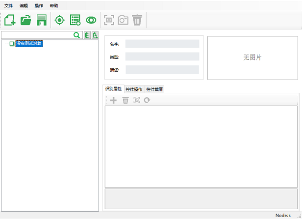
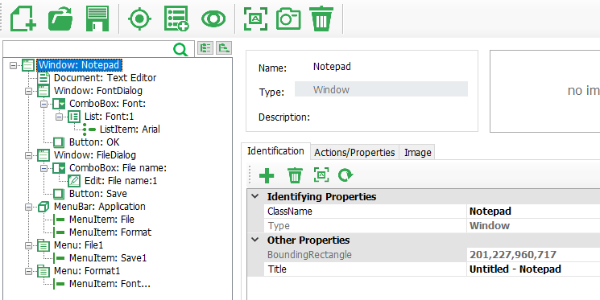
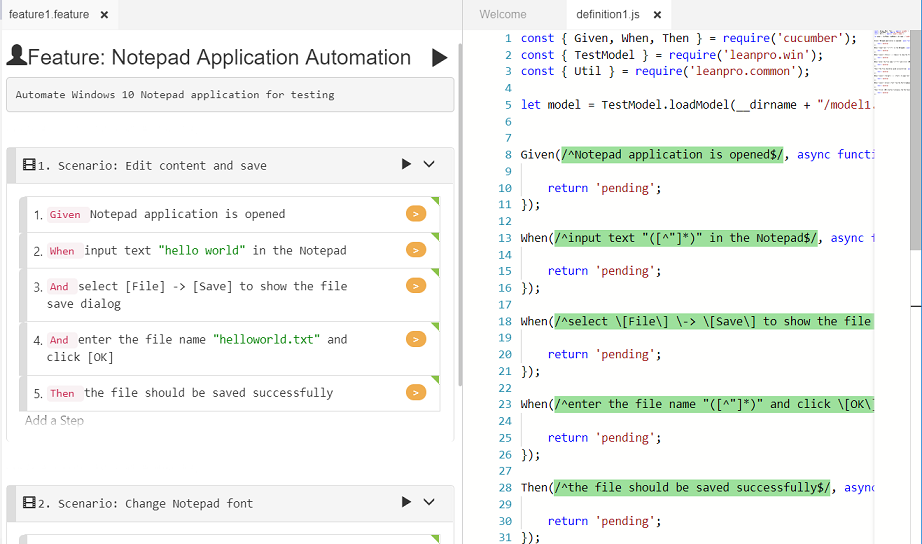
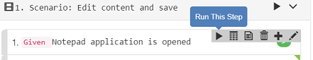
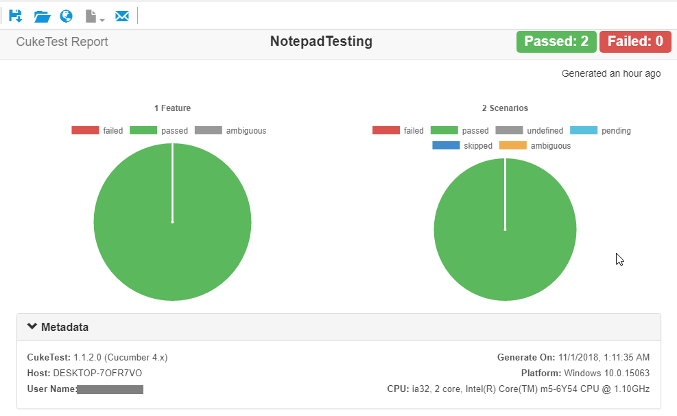
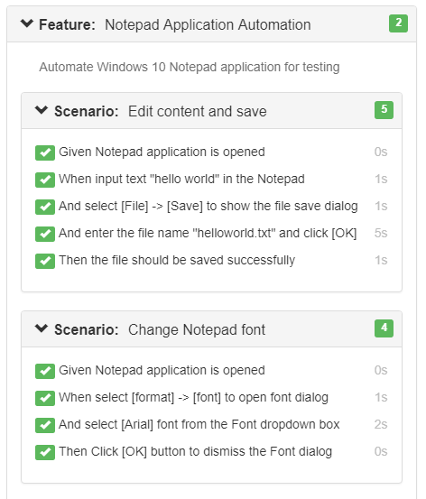

# Walkthrough: Create Test Automation Script for Windows Apps

This article demonstrates how to create an automation script for Windows 10 Notepad, using Node.js. You will also know how to create object model for your Windows application，and how to use Windows automation APIs.

In this walkthrough, we will:

* Create BDD scenarios that describe the automation steps
* Spy Notepad controls and add test objects to object model
* Implement the automation code
* Debug and run the script to get report

## 1. Create project

1. Open CukeTest, click "File" -&gt; "New Project"
2. Set "NotepadTesting" as the Project Name, and select "Windows" project template, also specify a Project Path, and then click "Create" to create the project.

   

## 2. Write scenarios

Open `feature1.feature` file, on "Visual" view, input the content according to the following picture.


For more information on how to edit feature file with "Visual" view, you can refer to [Walkthrough: Edit Feature File](feature_edit.md)

In "Text" view, you will find the content of the feature file:

```text
   Feature: Notepad Application Automation
   Automate Windows 10 Notepad application for testing

   Scenario: Edit content and save
      Given Notepad application is opened
      When input text "hello world" in the Notepad
      And select [File] -> [Save] to show the file save dialog
      And enter the file name "helloworld.txt" and click [OK]
      Then the file should be saved successfully

   Scenario: Change Notepad font
      Given Notepad application is opened
      When select [format] -> [font] to open font dialog
      And select [Arial] font from the Font dropdown box
      Then Click [OK] button to dismiss the Font dialog
```

## 3. Spy controls

When automate a Windows Application, "test objects" are used to identify windows controls. each Test Object contains a set of properties and rules used to locate the control. Test object information is stored in an object model file \(or in abbreviation, "model file"\), which is end with ".tmodel". Model Manager in CukeTest is used to create and manager the model file. Here is the quick instruction on how to spy and add objects to the model:

Click "Add Object" button to start the element spying, click the control you want to add, if the control is spied successfully, it shows the controls you want to add and its properties. Then you click "Add to Model" button to add it to the object model.

Please now follow the below steps to create the model:

* Click `step_definitions\model1.tmodel` file to open it in Model Manager.

  

* Open Notepad, spy the following list of controls, and add them to the model, also give them names as the "Object Name" column below:

| Text | Control Type | Object Name |
| :--- | :--- | :--- |
| "File" | MenuItem | File |
| "Save" | MenuItem | Save1 |
| "Format" | MenuItem | Format |
| "Font..." | MenuItem | Font... |
| "" | Document | TextEditor |

```text
One tip about spying, to spy the "Save" menu item, first press Ctrl key when click "File" menu, so that this click won't trigger spying dialog to show up, and then release Ctrl key when you click "Save".
```

* Open "Font" dialog by clicking "Format" -&gt; "Font..." menu, spy and add the following list of controls, and add them to the model.

| Text | Control Type | Object Name |
| :--- | :--- | :--- |
| "Arial" | ListItem | Arial |
| "OK" | Button | OK |

* Open the File Save dialog, spy and add the following list of the controls, and add them to the model

| Text | Control Type | Object Name |
| :--- | :--- | :--- |
| "" | Edit | File name:1 |
| "OK" | Button | OK |

After adding all these elements, your model should look like the following:



## 4. Start implementing the scenarios

1. Open `step_definations\definitions1.js` file, click the gray buttons on each step to generate the step definition code stub:

   

   notice that now the button next to step text are orange, which means the steps has matching step definition functions, but they are not implemented yet.

   You may also notice that, the model loading code has already been added to this file, so in the code when project is created, you can use this model variable directly to access these objects.

   Now you can open the `model1.tmodel` file, select an object from model tree，select "Actions/Properties" tab, and then copy the method from the list and add them to the script.

2. To implement the step definitions, first to implement the step "Given Notepad application is opened", you can use the "Util.launchProcess" API to launch the Notepad process:

   ```javascript
   Given(/^Notepad application is opened$/, async function () {
      if (!await model.getWindow("Notepad").exists(0)) {
         Util.launchProcess('c:\\Windows\\notepad.exe');
      }
   });
   ```

3. After writing the code, you can test it by right-clicking the step, and click "Run This Step" button on the step toolbar:

   

   this will just run the step for debugging purpose, and if succeed, your notepad should be launched.

4. Before implementing the rest steps, we should add hook functions, to minimize the CukeTest window when the script starts, and restore the CukeTest window when the run is finished, we can achieve this in the `BeforeAll` and `AfterAll` hooks. Add a file "support/hooks.js", and put the following content:

   ```javascript
   const {BeforeAll, AfterAll, setDefaultTimeout} = require('cucumber')
   const cuketest = require('cuketest');

   setDefaultTimeout(20 * 1000);

   BeforeAll(async function() {
       await cuketest.minimize();
       await cuketest.delay(1000);
   })

   AfterAll(async function () {
       await cuketest.delay(1000);
       await cuketest.maximize();
   })
   ```

   In hooks.js, we set the step timeout to be 20 seconds instead of default 5 seconds, which is a bit short for windows automation script. Also, in `BeforeAll`, we minimize the CukeTest window before running any scenarios, wait for 1 second till the minimization actually take effect, so that it won't interfere with the UI of application under test when perform automation operations.

## 5. Implement all automation steps

1. Now we can implement the second step:

   ```text
      When input text "hello world" in the Notepad
   ```

   In this step definition function sub, change the parameter name to be "text", and drag the "Text Editor" object from Model Manager to the function, select the `set` method, and fill the parameter "text" in it, the code is as the following:

   ```javascript
   When(/^input text "([^"]*)" in the Notepad$/, async function (text) {
      await model.getDocument("Text Editor").set(text);
   });
   ```

   Assume you have opened a Notepad, you can now right click the step text, and select "Run This Step" as you did for the first step, it will minimize the CukeTest, set the Notepad content to be "hello world", and then restore CukeTest window. If this step runs successfully, you can add the rest steps similarly.

2. To save the paragraph, I paste all the definitions1.js code below:

   ```javascript
    const { Given, When, Then } = require('cucumber');
    const { TestModel } = require('leanpro.win');
    const { Util } = require('leanpro.common');
    const fs = require('fs');
    const cuketest = require('cuketest')
    const assert = require('assert')

    let model = TestModel.loadModel(__dirname + "/model1.tmodel");

    Given(/^Notepad application is opened$/, async function () {
        if (!await model.getWindow("Notepad").exists(0)) {
            Util.launchProcess('c:\\Windows\\notepad.exe');
        }
    });

    When(/^input text "([^"]*)" in the Notepad$/, async function (text) {
        await model.getDocument("Text Editor").set(text);
    });

    When(/^select \[File\] \-> \[Save\] to show the file save dialog$/, async function () {
        await model.getMenuItem("File").click();
        await model.getMenuItem("Save1").click();
    });

    When(/^enter the file name "([^"]*)" and click \[OK\]$/, async function (fileName) {
        this.fileName = __dirname + '\\' + fileName;
        if (fs.existsSync(this.fileName)) {
            fs.unlinkSync(this.fileName); //remove the file if it exists
        }

        await cuketest.delay(1000)

        await model.getEdit("File name:1").set(this.fileName);
        await model.getButton("Save").click();
    });

    Then(/^the file should be saved successfully$/, async function () {
        await cuketest.delay(1000)
        assert.ok(fs.existsSync(this.fileName), `${this.fileName} should exists`);
    });

    When(/^select \[format\] \-> \[font\] to open font dialog$/, async function () {
        await model.getMenuItem("Format").click();
        await model.getMenuItem("Font...").click();
        await cuketest.delay(1000);
    });

    When(/^select \[Arial\] font from the Font dropdown box$/, async function () {
        await model.getList("Font:1").select('Arial');
        await cuketest.delay(1000);
    });

    Then(/^Click \[OK\] button to dismiss the Font dialog$/, async function () {
        await model.getButton("OK").click();
    });
   ```

   to make sure it runs successfully in repeated run, it will delete the existing file before saving.

## 6. Run

Click run button, it will run these two scenarios, and then open the test report, like the following:

 

