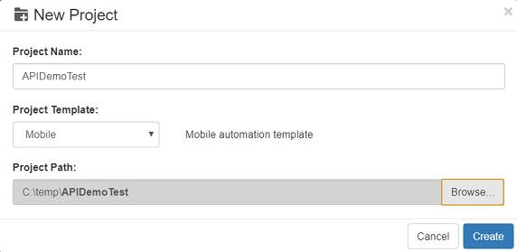
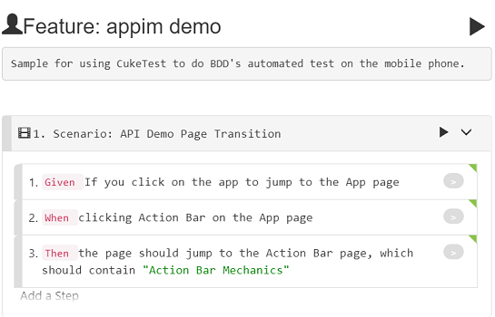
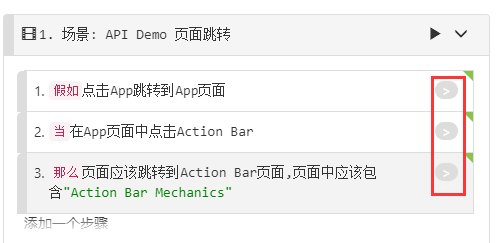
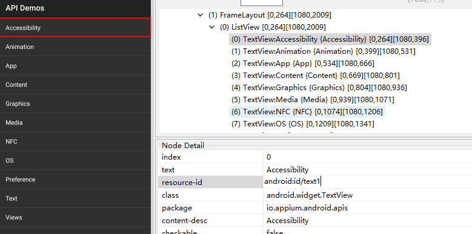
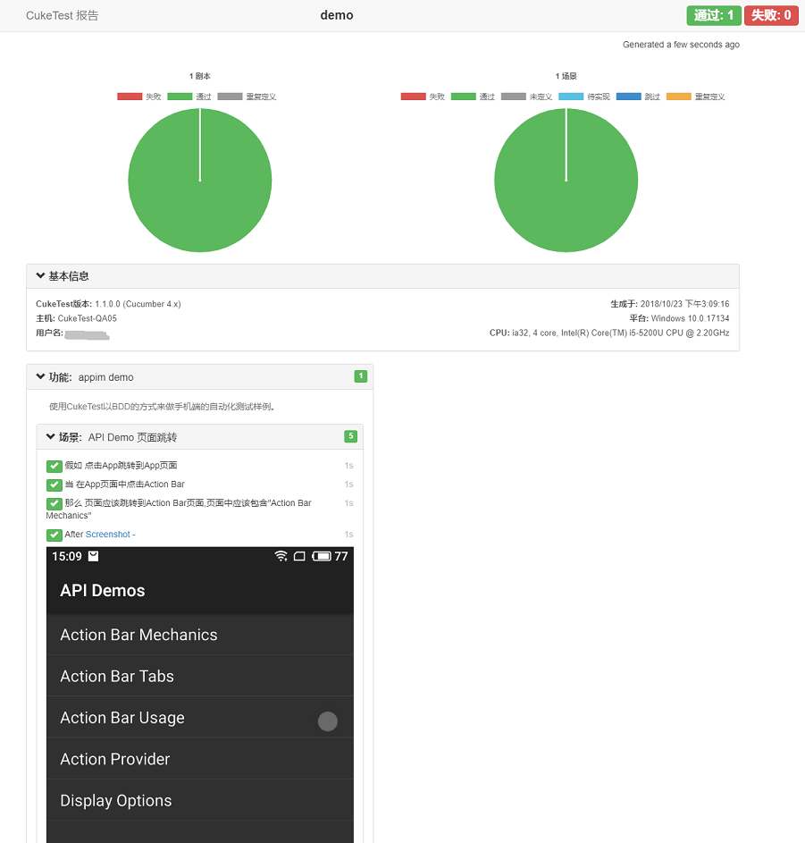

## Walkthrough: Create Android Automation Test

### Goal

* Understand how to locate mobile app controls
* Master Android mobile phone automated testing process

### Prerequisites
* Dependencies: 
    * Android SDK
    * Android phone or emulator
    * Appium
* Application Under Test (AUT): API Demo shipped with Appium

### Steps

#### New Project

Open CukeTest, "File"--"New Project"
Choose "Mobile", input project name "APIDemoTest" and select project path, then click "Create"。



CukeTest will automatically create a automation script project based on mobile template. Please run the `npm install` command to install the project dependencies in the project directory.

#### Prepare AUT

The app to be tested can be downloaded from: [https://github.com/appium/sample-code/tree/master/sample-code/apps/ApiDemos/bin](https://github.com/appium/sample-code/tree/master/sample-code/apps/ApiDemos/bin), try to download it and install on your own mobile device.


#### Create Test Scenarios

Open the file and enter the following in the "Visual" interface:



The corresponding "text" view content is: 

```gherkin
Feature: appim demo
Sample for using CukeTest to do BDD's automated test on the mobile phone.

  Scenario: API Demo Page Transition
    Given If you click on the app to jump to the App page
    When clicking Action Bar on the App page
    Then the page should jump to the Action Bar page, which should contain "Action Bar Mechanics"
```

#### Implement Test Automation Code

1. Get device serial number:

  ```powershell
  adb devices

  List of devices attached
  Y15QKCPH278J4   device
  ```
  
2. Get the app package and start the activity
  Run command `adb logcat | findstr START `, open __Demo API__ app manually, read the info similiar to the following from the log:

  ```basic

  ...
  [android.intent.category.LAUNCHER] flg=0x10200000 cmp=io.appium.android.apis/.ApiDemos bnds=[16,640][188,832] (has extras)} from uid
10013 from pid 1943 on display 0 from pid 1943
  ...

  ```

  get the package/activity info, which is io.appium.android.apis/.ApiDemos

3. Modify driver definition code

  Open file `support\get_driver.js`, modify the content of `devicesName`, appPackage, appActivity. the content of it is:
  
  ```javascript
  const webdriverio = require('webdriverio');

  //Set the parameters for testing the application
  let options = {
    desiredCapabilities: {
        platformName: "Android",
        deviceName: "Y15QKCPH278J4", //Serial#
        platformVersion: "5.1", //Android version
        appPackage: "io.appium.android.apis", //package name
        appActivity: ".ApiDemos", //activity name
        resetKeyboard: true,  
        noReset: true,
        unicodeKeyboard: true
    },
    host: "127.0.0.1",
    port: 4723
  }

  //Create a WebDriverIO instance based on the parameter configuration;
  function createDriver() {
    const client = webdriverio.remote(options);
    return client;
  }

  exports.driver = createDriver();
  ```

4. Test automation code
  Open `features/feature1.feature` file, click the gray button on each step to generate a sample automation script.

  

  Use the *uiautomatorviewer* tool to navigate to client elements

  

  Implemnt step defintion functions defined in "step\_definitons/definitoins.js":

  ```javascript
  const { Given, When, Then } = require('cucumber')
  const assert = require('assert');
  const { driver } = require('../support/get_driver');
  const { $ } = require('webdriverio')

  //// Your step definition /////

  Given("If you click on the app to jump to the App page", async function () {
    await driver.click('android=new UiSelector().text("App").index(2)')
  });

  When("clicking Action Bar on the App page", async function () {
      await driver.click('android=new UiSelector().text("Action Bar").index(0)');
  });

  Then("the page should jump to the Action Bar page, which should contain {string}", async function (arg1) {
    let texts =  await driver.getText('android=new UiSelector().textStartsWith("Action")');
    console.log(texts)
    return assert.ok(texts.includes(text));
  });
  
  ```

#### Run the Project

1. Start Appium

  ```basic
  appium

  [Appium] Welcome to Appium v1.8.1
  [Appium] Appium REST http interface listener started on 0.0.0.0:4723
  ```

2. Run the Project

  Click the Run Project button to start the running, and then you should be able to get the following report

  

