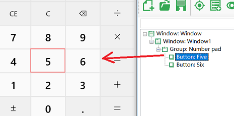
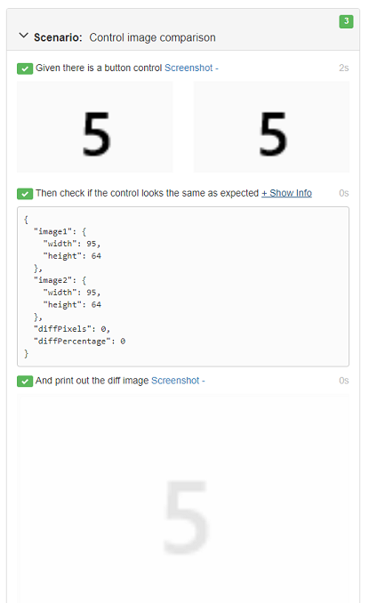

## Walkthrough: Image Comparison

This walkthrough demonstrates how to use the image comparison APIs to get the snapshot images, make modifications to the image, compare images, and generate the comparison image in the report. The Calculator on Windows 10 is used as the sample application.

More information on image comparison can be found at: [Image APIs](/node_api/image.md), and[Virtual Control API](/node_api/virtual_api.md)


### First create a scenario

Choose to create a new project and use the "Basic" template when creating. And add the following scenario.

```gherkin
  Scenario: Control image comparison
    Given there is a button control
    Then check if the control looks the same as expected
    And print out the diff image
```

### Create object model
For the calculator, get the object of one of the buttons and add it to the model. For example, here we added the "5" button:





### Implement the scenario

Write the following code in definitions1.js, basically it gets a screenshot of the button control, compare it with the image in the model and generate the resulting image in the report. 

```javascript
const { TestModel } = require('leanpro.win');
const { Image } = require('leanpro.visual');
const { Given, When, Then } = require('cucumber');
const model = TestModel.loadModel(__dirname + "\\..\\..\\test.tmodel");

Given("there is a button control", async function () {
    //take screenshots from controls
    let five = model.getButton("Five");
    let screen1 = await five.takeScreenshot();
    let screen2 = await five.modelImage();
    
    //clip the edges from the images
    let controlImage = this.controlImage = await Image.fromData(screen1);
    let modelImage = this.modelImage = await Image.fromData(screen2);
    controlImage = controlImage.clip({ x: 10, y: 10, width: controlImage.width - 20, height: controlImage.height - 20 });
    modelImage = modelImage.clip({ x: 10, y: 10, width: modelImage.width - 20, height: modelImage.height - 20  });

    //put the images side by side, and attach to the report
    let combinedImage = controlImage.drawImage(modelImage, controlImage.width + 10, 0);
    this.attach(await combinedImage.getData(), 'image/png');
});

Then("check if the control looks the same as expected", async function () {
    let result = await Image.imageCompare(this.controlImage, this.modelImage);
    this.attach(JSON.stringify(result.info, null, 2), 'text/plain');
    this.result = result;
});

Then("Then print out the diff image", async function () {
    let data = await this.result.diffImage.getData();
    this.attach(data, 'image/png');
});
```

(Please modify the path to test.tmodel in the above code to point to your own object model file)

There are 3 steps in this scenario, in the first step definition:

  1. Get a screenshot of the button "5" and the corresponding screenshot saved in the model.
  2. Call `clip` to clip the 10 pixels edges from around the images,
  3. Attach these two images to the World so that we can compare them in the following steps.
  4. Call drawImage to draw them into one image, and attach it to the report.

In the second step definition:

  1. Call `imageCompare` to compare the two images retrieved from World object, return the comparison data, and insert the comparison data as text into the object model.

  2. In report one step can only have one attachment (either text data or image), if you want to also attach image to the report, need to do it in the next step. So in this step, attach the data to "World" object by `this.result = result`, so that it can be used in the next step.

In the third step definition function:

  1. Get the image data from the World object
  
  2. Call `this.attach()` to attach the image to the report.

### Run the project

Run the project, you can see the output of the image comparison info as well as the result image displayed in the report:



Because the control's screenshot and the one in the model are identical, the scenario is passed.


