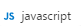
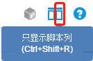

## Walkthrough: Edit JavaScript File

### 1. Create a js file
Open CukeTest, long click "New Feature/Script" button, it will show a menu list, then move mouse to "JavaScript"  and release mouse, the js file will be created.

### 2. Edit js file.

Enter the following content in the code view:

```javascript
console.log("hello CukeTest")
```

Click "Only show Script Column" button from toolbar, so that the script editor view can show in full width.

### 3.	Save js file
Press key combination "Ctrl+S" (⌘S on Mac), or select "File" -> "Save", file save dialog is opened, fill the file name and then save the file.


### 4. Run js file

If you have javascript editing tab active, and there are no other feature tabs opened, you can click "Run Script" button to run the opened script file. Output panel will also be shown, showing you the console output of the script run.


